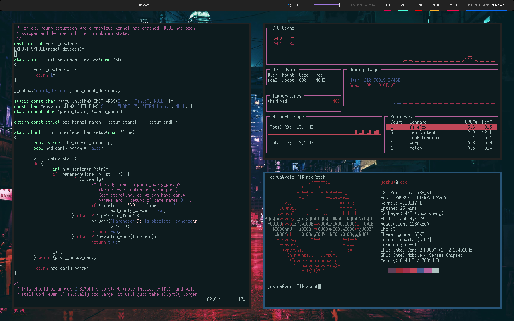

# gentoo
My dotfiles, scripts and downstream forks + patches.

_My i3 setup in Void Linux running on my Thinkpad X200_

## Install & Usage:
Install `stow` and `git` then:

`git clone https://github.com/ranguli/dotfiles && cd ./dotfiles && stow package`

